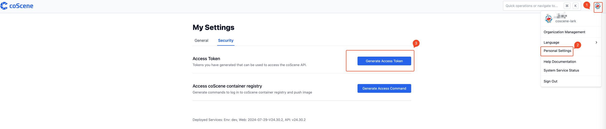
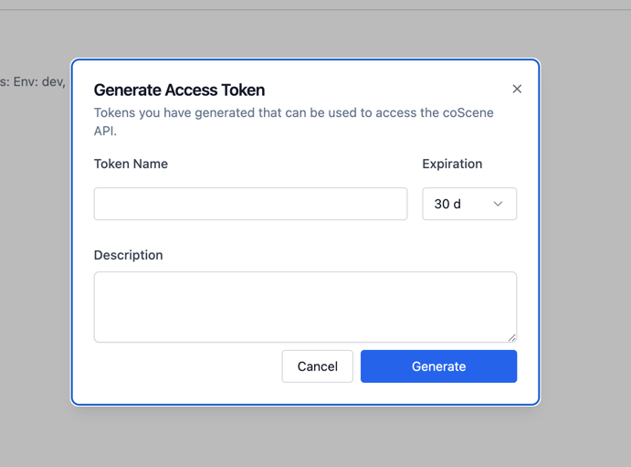

# coScene OpenAPI Example

## Introduction

We use Protobuf to define the API and generate the openapi.yaml file. And
use [buf](https://buf.build/coscene-io/coscene-openapi) to generate the SDK for the API. You can see source code in the [buf](https://buf.build/coscene-io/coscene-openapi/tree) repository.

The API is defined in the openapi.yaml file. The API is defined using the OpenAPI 3.0.3 specification. You can view the
OpenAPI file using
the [Swagger Editor](https://petstore.swagger.io/?url=https://download.coscene.cn/openapi/openapi.yaml).

This is an example of how to use the coScene OpenAPI to get the organization's information.

## Authentication

The coScene API uses API keys to authenticate requests. You can view and manage your API keys in the coScene web
console. Your API keys will use same permissions as your user account.

Follow the steps, you will generate an API key. And please keep your API key secure. Do not share your secret API key in
publicly accessible areas such as GitHub, client-side code, and so on.

## Example

You can view the full example in the subdirectory. We provide the example in multiple languages including Python, Go, Java. if you want to use the SDK in other languages, you can generate the SDK in [buf](https://buf.build/coscene-io/coscene-openapi/sdks) and read the [buf documentation](https://buf.build/docs/bsr/generated-sdks/overview).
